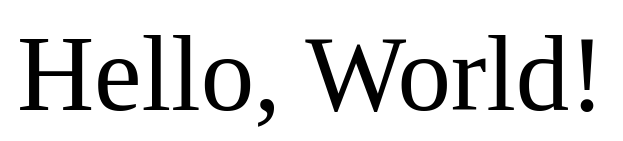

# My custom markdown file

## Link

[Buna!](https://www.youtube.com/watch?v=67YEchCUqmQ)

## Code snippet:

```python
print("Hello World!")
```


## Table

|salut|vere|
|-----|-----|
|asta e |un tabel|
|foarte|fain|


## Order string:

1. Lapte
2. Bere
3. Supa

## Unordered list:

- caiet mate
- caiet romana
- caiet geogra

* telefon
* laptop
* mapa fizica

## Headings:

### Heading 3
#### Heading 4
##### Heading 5
###### Heading 6

## Image:



## Emoji:

:blush:
